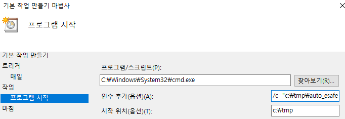

# auto_esafe

## 개요

1. eSAFE2019을 실행
2. 공인인증서로 로그인(하드에 존재)
3. 화면번호를 입력
4. 파일 다운로드
5. eSAFE2019 종료
6. 다운로드 받은 파일을 ftp서버에 put
7. 조회 조건에서 [공공데이터](https://www.data.go.kr/)의 open api를 사용

## 동작

1. 500068 : tab1, tab2 (csv + excel) -> 3개 파일
2. 500038 : tab1, excel (날짜 : 전영업일-무조건전일) -> 1개파일
3. 800008 : 증권구분을 집합투자증권, 날짜 (별도고려필요), excel로 저장 , 설립일/발행 : 전영업일-금일 -> 1개파일
4. 800100 : 조건없이 조회, csv -> 1 개파일
5. 6개의 파일을 ftp로 전송
6. 매일 정해진 pc에서 정해진 시간에 동작하는 것으로 한다.

## 제약조건

1. 화면 크기 FHD에서 동작
2. 공인인증서는 하드에 존재.
3. 공인인증서 사용자 고정

## 기능

1. .env를 사용함. password저장
2. config에 상수 보관
3. log폴더에 auto_esafe_yyyy_mm_dd.log 생성
4. log폴더는 exe파일이 있는 폴더 하위에 log라는 이름으로 만들어짐
5. 매일 특정시간에 동작하는 것을 기본으로 함(window자체 scheduler사용)
6. pyinstaller를 사용하여 exe파일을 만든다.
7. 다운로드 받은 excel은 csv로 변환되어 ftp 서버에 upload된다.

## 빌드

- pyinstaller로 exe파일을 만듬
- 가상환경에서 작업해야함

```shell
source env/Script/activate
which python
which pip
rm -rf ./dist ./build
pyinstaller  auto_esafe.spec
```

## 설치

- 윈도우 pc에 task 스케줄러 이용, 매일 정해진 시간에 동작하게 함.
- window + r , taskschd.msc

- 주의할 점은 auto_esafe가 동작할 때 모니터가 켜져 있어야 하며 동작 중에 마우스를 움직여서는 안됨.

설정 → 시스템 → 디스플레이 → 고급 디스플레이 설정에서 디스플레이를 항상 유지
전원 관리 옵션에서 디스플레이 끄기: 안 함 설정

절전 모드로 인해 실행이 안 될 경우 해결 방법
만약 컴퓨터가 절전 모드로 인해 작업을 수행하지 못하는 경우, 다음 설정을 확인하세요.

절전 모드 해제 (권장)

⚙ 설정 → 시스템 → 전원 및 절전에서 "절전 모드"를 "안 함"으로 설정
또는 고급 전원 옵션에서 컴퓨터를 절전 모드로 설정을 "해제"
작업 스케줄러에서 "대기 모드 해제" 설정

작업 스케줄러(taskschd.msc) 실행
해당 작업 선택 후 "속성" → "전원" 탭에서
✅ 작업을 실행하기 위해 대기 모드 해제 체크
Wake Timer(예약된 작업이 절전 모드 해제 가능하게 설정)

전원 옵션 → 고급 전원 설정에서
절전 → Allow wake timers (예약된 작업 깨우기) → "사용"

## 해야할일

TODO  다음을 읽고 해결

1. hts 팝업제거
2. 나만의 스크립트 언어를 만들고 그것을 읽어들이면서 수행하는 것.
3. spec_test 프로젝트를 만들어서 테스트 .env /images 폴더의 이미지 사용
4. finished_chong 을 못 찾는 것 확인
5. log를 다른 py에서도 사용하자.
6. debugging pytest로 테스팅을 ai에게 맡기자.
7. .env에 LOG_LEVEL=DEBUG 로

## History

1.0.3 : 사용자명으로 이미지를 내부에서 만들어서 비교
1.0.4 : 인증서 위치를 클릭하도록 수정.
1.0.5 : 느린 pc에서도 조회가 되도록 최대 10분으로 조회 시간을 늘림.
1.0.6 : 일부 이미지 grayscale로
1.0.7 : save path 오류수정
1.0.8 : 500068추가
1.0.9 : SFTP로 변경
