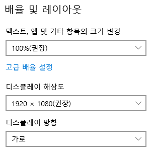

# auto_esafe 사용자 매뉴얼

## 개요

esafe 2019 프로그램을 자동으로 수행시켜서 필요한 파일들을 다운로드 후  ftp 서버에 올리는 자돟으로 수행시킴

## 준비

1. 모니터의 디스플레이 속성이 1920x1080, 100%배열, 가로방향이어야 함

2. 공인인증서 : 구윤진님의 공인인증서가 하드디스크에 설치되어 있어야 함.
3. eSAFE2019.exe 가 PC에 있어야 함

## 설치 및 실행

1. 특정 폴더에 auto_esafe.exe와 .env 2개의 파일을 copy
2. 특정 폴더를 c:\tmp로 가정
3. .env를 환경에 맞게 수정 (hotepad 이용)
   1. PROGRAM_PATH <수정필요>
   2. SAVE_AS_PATH1 <수정필요>
4. win+r cmd
5. cd \tmp
6. auto_esafe.exe

## 동작순서

auto_esafe는 다음과 같은 과정을 거치며 동작합니다.

1. pre_check : 화면 모니터, 필요한 파일들의 존재 여부 등 체크
2. holiday_check: 휴일에는 동작하지 않습니다.
3. 기존파일들 삭제: 오늘의 날짜로 되어 있는파일들 삭제
4. eSafe2019실행 및 파일 다운로드
5. 다운로드한 파일들을 csv로 변환
6. csv로 변환된 파일들을 ftp서버로 전송

## 결과 확인

auto_esafe.exe가 실행된 후 동작에 대한 확인

1. c:\tmp\log 폴더 확인, 오늘의 날짜로 된 로그를 확인
2. .env에 기술된 ftp서버확인
